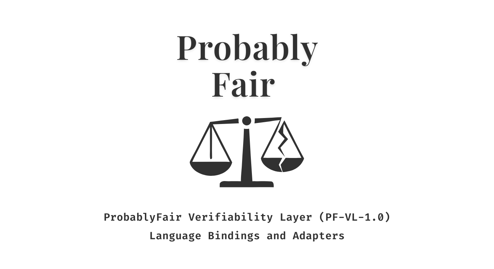

<p align="center">
  
</p>

# PF Bindings

Native bindings for the Probably Fair core library, providing high-performance cryptographic operations for verifiable betting systems.

## Supported Languages

- **JavaScript/TypeScript** (`@probablyfair/pf-bindings`) - npm package
- **Python** (`pf-bindings-python`) - PyPI package
- **Go** (`github.com/probablyfair/pf-bindings-go`) - Go module
- **Java** (`com.probablyfair:pf-bindings-java`) - Maven package
- **C#** (`PF.Bindings`) - NuGet package
- **Swift** (`PfBindings`) - Swift Package
- **Rust** (`pf-bindings-core`) - Cargo crate
- **WebAssembly** (`@probablyfair/pf-bindings-wasm`) - npm package
- **PHP** (`probablyfair/pf-bindings`) - Composer package
- **Dart** (`pf_bindings`) - pub.dev package
- **C/C++** - Static/shared libraries

## Installation

### Node.js/JavaScript

```bash
npm install @probablyfair/pf-bindings
```

### Python

```bash
pip install pf-bindings-python
```

### Go

```go
import "github.com/probablyfair/pf-bindings-go"
```

### Java

```xml
<dependency>
    <groupId>com.probablyfair</groupId>
    <artifactId>pf-bindings-java</artifactId>
    <version>0.1.0</version>
</dependency>
```

### C#

```bash
dotnet add package PF.Bindings
```

### Swift

```swift
dependencies: [
    .package(url: "https://github.com/probablyfair/pf-bindings", from: "0.1.0")
]
```

## Usage

### Node.js

```javascript
const { verifyBet, registerGdpPackage } = require('@probablyfair/pf-bindings');

// Verify a bet receipt
try {
  verifyBet(receiptJson, transcriptJson);
  console.log('Bet verified successfully');
} catch (error) {
  console.error('Verification failed:', error.message);
}

// Register a GDP package
try {
  registerGdpPackage(packageBuffer);
  console.log('GDP package registered');
} catch (error) {
  console.error('Registration failed:', error.message);
}
```

### Python

```python
import pf_bindings_python

# Verify a bet receipt
try:
    pf_bindings_python.verify_bet(receipt_json, transcript_json)
    print("Bet verified successfully")
except Exception as e:
    print(f"Verification failed: {e}")

# Register a GDP package
try:
    pf_bindings_python.register_gdp_package(package_bytes)
    print("GDP package registered")
except Exception as e:
    print(f"Registration failed: {e}")
```

## API Reference

### Functions

- `verifyBet(receiptJson: string, transcriptJson: string) -> void` (Node.js)
- `verify_bet(receipt_json: str, transcript_json: str) -> None` (Python)
  - Verifies a bet receipt against its transcript
  - Throws an exception if verification fails

- `registerGdpPackage(bytes: Buffer) -> void` (Node.js)
- `register_gdp_package(bytes: bytes) -> None` (Python)
  - Registers a GDP package for use in betting operations
  - Throws an exception if registration fails

## Supported Platforms

macOS (x64, arm64), Linux (x64, arm64), Windows (x64)

## Development

### Building

```bash
# Node.js bindings
npm run build

# Python bindings
cd crates/pf-bindings-python
maturin develop
```

### Testing

```bash
# Node.js tests
npm test

# Rust tests
cargo test --workspace
```

## License

Apache License 2.0

## Support

- Issues: [GitHub Issues](https://github.com/probablyfair/pf-bindings/issues)
- Documentation: [Probably Fair Docs](https://docs.probablyfair.com)
